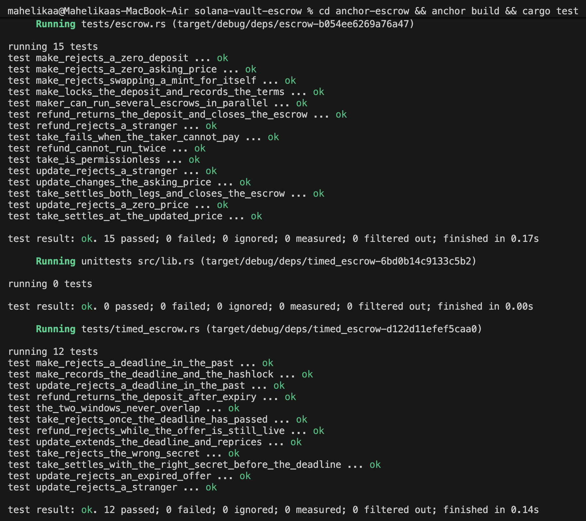

# Anchor Escrow

Two Anchor programs, tested with [LiteSVM](https://github.com/LiteSVM/litesvm).

| Program | Description |
| --- | --- |
| `escrow` | Two-party SPL token swap — make, take, refund, update. |
| `timed-escrow` | The same swap, gated on a deadline from the `Clock` sysvar and a secret the taker must reveal. |

## escrow

Alice locks token A and names a price in token B. Anyone holding B can fill it. Until someone does, she can re-price or cancel.

| Instruction | Description |
| --- | --- |
| `make(seed, deposit, receive)` | Locks the deposit in a vault and records the asking price. |
| `take` | Pays the maker, releases the deposit to the taker, closes both accounts. |
| `refund` | Returns the deposit to the maker and closes everything. |
| `update(receive)` | Re-prices a live offer; the deposit is untouched. |

**Accounts**

```
Escrow  PDA  seeds ["escrow", maker, seed]  { seed, maker, mint_a, mint_b, receive, bump }
vault        ATA of (escrow PDA, mint_a)    custodies the deposit
```

The vault's authority is the escrow PDA, so the deposit only moves by the program's own signature. `seed` is a maker-chosen `u64`, allowing several offers at once.

**Notes**

- `take` settles both legs in one instruction — either the whole swap lands or none of it does.
- `transfer_checked` throughout, so Token-2022 works via `InterfaceAccount` / `TokenInterface`.
- Anchor's `close` handles the escrow state, but the vault belongs to the token program and needs an explicit `close_account` CPI.
- `Take` touches eight deserialised accounts; left on the stack that overflows an SBF frame, so they are `Box`ed.
- The escrow PDA derives from the maker, so `refund` and `update` on someone else's escrow fail the seeds check.

## timed-escrow

The release condition is a **hash-lock**. The maker publishes `sha256(secret)` and a deadline; the secret stays off-chain until they are satisfied the other side of the deal happened. Revealing it on-chain releases the funds.

| Instruction | Gate |
| --- | --- |
| `make(..., expires_at, hashlock)` | `expires_at` must be in the future. |
| `take(preimage)` | `now < expires_at` **and** `sha256(preimage) == hashlock`. |
| `refund` | `now >= expires_at`. |
| `update(receive, expires_at)` | Only while live; new deadline must be in the future. |

**The two windows never overlap.** Before the deadline only the taker can act, and only with the secret — the maker cannot refund out from under a taker who has already performed. After it, only the maker can. No moment where both can move, none where neither can, so the deposit is never strandable.

`update` is refused once expired, so a dead offer cannot be revived to surprise a taker who wrote it off.

Deadline behaviour is tested by moving time, not waiting — LiteSVM overwrites the `Clock` sysvar the program reads through `Clock::get()`.

## Build and test

```bash
anchor build
cargo test
```

`anchor build` must run first — the tests embed the compiled `.so` via `include_bytes!`, so testing after a program change without rebuilding silently tests the previous binary.

**27 tests** — 15 for `escrow`, 12 for `timed-escrow`, covering every instruction plus failure paths, each asserted against its specific Anchor error.


